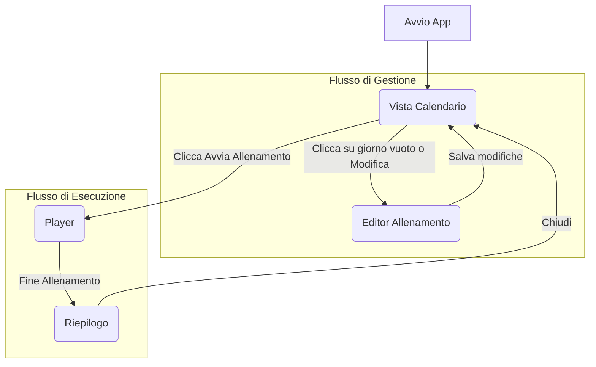

# Livello 1: Flusso Funzionale Generale

Questo diagramma illustra una mappa completa ma generica di tutte le funzionalità principali dell'applicazione e dei percorsi che l'utente può intraprendere.

