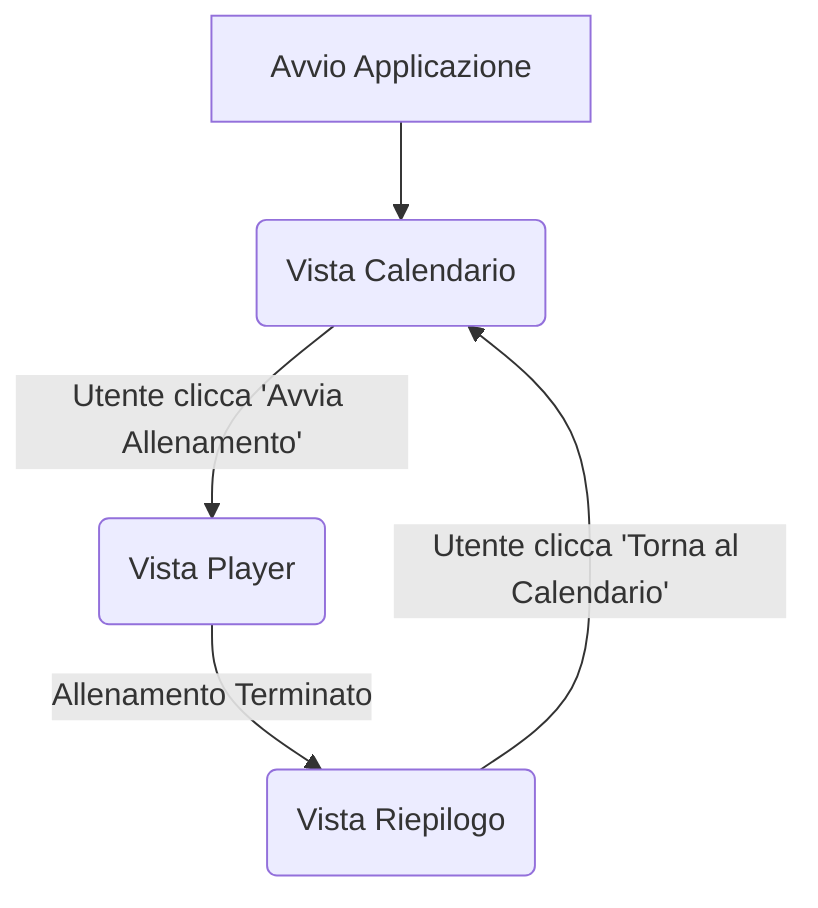

# Livello 1: Flusso di Navigazione Principale

Questo diagramma illustra la navigazione di alto livello tra le viste principali dell'applicazione. Rappresenta la "mappa" fondamentale del sito.

```mermaid
graph TD
    A[Avvio Applicazione] --> B(Vista Calendario);
    B --> |Utente clicca 'Avvia Allenamento'| C(Vista Player);
    C --> |Allenamento Terminato| D(Vista Riepilogo);
    D --> |Utente clicca 'Torna al Calendario'| B;
```