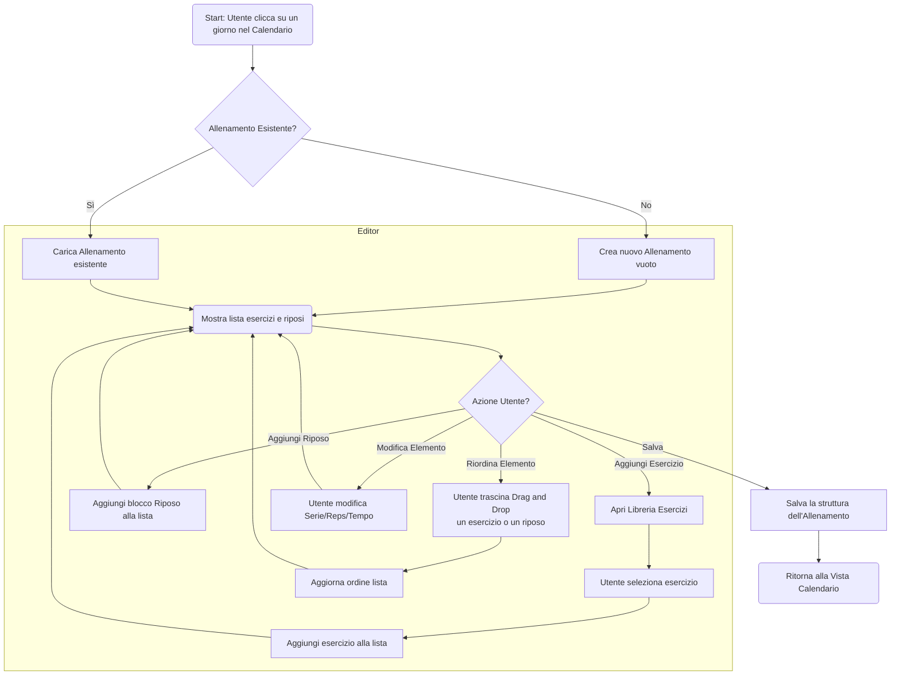

# Livello 2: Flusso di Gestione dell'Allenamento (Editor)

Questo diagramma dettaglia le operazioni all'interno dell'Editor Allenamento.

```mermaid
graph TD
    A(Start: Utente clicca su un giorno nel Calendario) --> B{Allenamento Esistente?};
    
    B -- No --> C[Crea nuovo Allenamento vuoto];
    B -- Sì --> D[Carica Allenamento esistente];

    subgraph Editor
        C --> E(Mostra lista vuota);
        D --> E(Mostra lista esercizi e riposi);
        
        E --> F{Azione Utente?};
        
        F -- Aggiungi Esercizio --> G[Apri Libreria Esercizi];
        G --> H[Utente seleziona esercizio];
        H --> I[Aggiungi esercizio alla lista];
        I --> E;

        F -- Aggiungi Riposo --> J[Aggiungi blocco Riposo alla lista];
        J --> E;

        F -- Riordina Elemento --> K[Utente trascina Drag and Drop<br>un esercizio o un riposo];
        K --> L[Aggiorna ordine lista];
        L --> E;
        
        F -- Modifica Elemento --> M[Utente modifica Serie/Reps/Tempo];
        M --> E;
    end

    F -- Salva --> N[Salva la struttura dell'Allenamento];
    N --> O(Ritorna alla Vista Calendario);
```