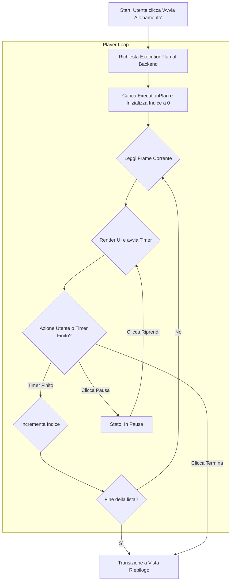

# Livello 2: Flusso di Esecuzione dell'Allenamento (Player)

Questo diagramma dettaglia le operazioni all'interno del Player, includendo le interazioni di pausa e interruzione.

```mermaid
graph TD
    A[Start: Utente clicca 'Avvia Allenamento'] --> B[Richiesta ExecutionPlan al Backend];
    
    subgraph Player Loop
        B --> C[Carica ExecutionPlan e Inizializza Indice a 0];
        C --> D{Leggi Frame Corrente};
        D --> E{Render UI e avvia Timer};

        E --> F{Azione Utente o Timer Finito?};
        
        F -- Timer Finito --> G{Incrementa Indice};
        G --> H{Fine della lista?};
        H -- No --> D;
        
        F -- Clicca Pausa --> I[Stato: In Pausa];
        I --> |Clicca Riprendi| E;
    end
    
    H -- Sì --> K[Transizione a Vista Riepilogo];
    F -- Clicca Termina --> K;

```