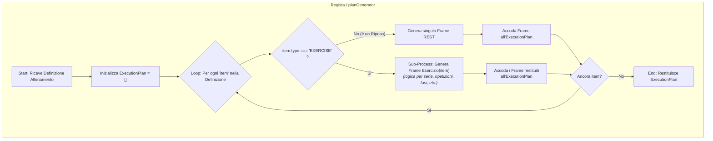

# Livello 3: Flusso di Generazione dell'ExecutionPlan (Regista)

Questo diagramma descrive l'algoritmo di alto livello che il "Regista" (backend) usa per trasformare la definizione di un allenamento in un `ExecutionPlan` sequenziale, pronto per essere eseguito dal "Player" (frontend).

