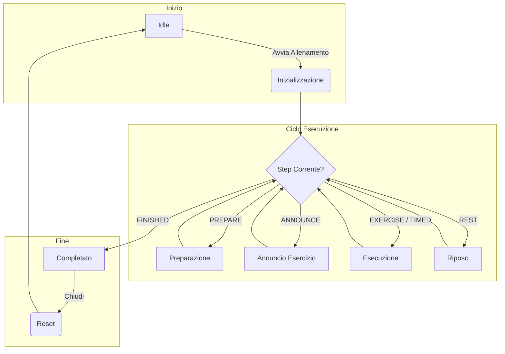

# Flowchart: Macchina a Stati del TrainerView

```mermaid
graph TD
    subgraph Inizio
        A[Idle] -->|Avvia Allenamento| B(Inizializzazione)
    end
    subgraph Ciclo Esecuzione
        B --> C{Step Corrente?}
        C -->|PREPARE| D[Preparazione]
        D --> C
        C -->|ANNOUNCE| E[Annuncio Esercizio]
        E --> C
        C -->|EXERCISE / TIMED| F[Esecuzione]
        F --> C
        C -->|REST| G[Riposo]
        G --> C
    end
    subgraph Fine
        C -->|FINISHED| H[Completato]
        H -->|Chiudi| I(Reset)
        I --> A
    end
```
