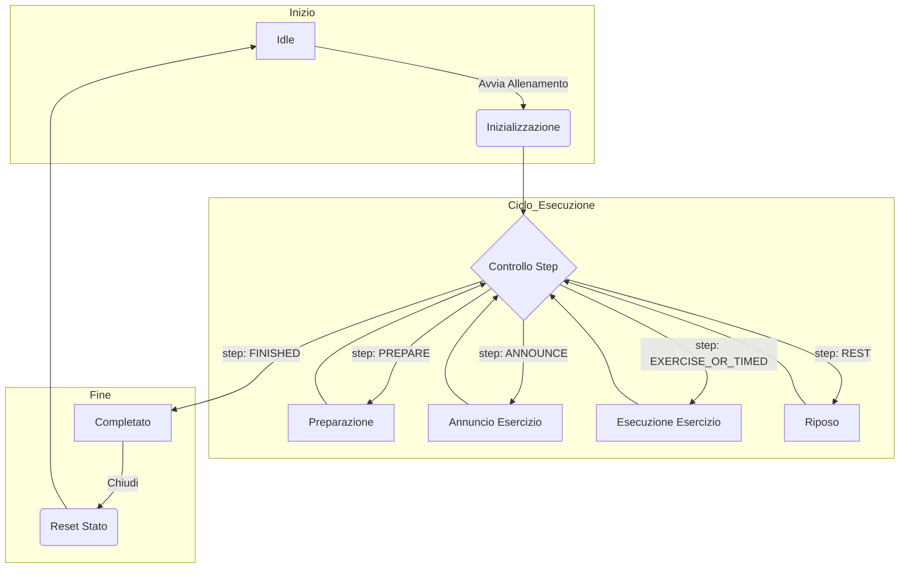

# Flowchart: Macchina a Stati del TrainerView

Questo flowchart descrive la logica di stato del componente `TrainerView`. La sintassi è stata ottimizzata per la massima compatibilità.

```mermaid
graph TD
    %% Il grafo è definito da cima a basso (Top Down)

    subgraph Inizio
        A[Idle] -->|Avvia Allenamento| B(Inizializzazione)
    end

    subgraph Ciclo_Esecuzione
        B --> C{Controllo Step}
        C -->|step: PREPARE| D[Preparazione]
        D --> C
        C -->|step: ANNOUNCE| E[Annuncio Esercizio]
        E --> C
        C -->|step: EXERCISE_OR_TIMED| F[Esecuzione Esercizio]
        F --> C
        C -->|step: REST| G[Riposo]
        G --> C
    end

    subgraph Fine
        C -->|step: FINISHED| H[Completato]
        H -->|Chiudi| I(Reset Stato)
        I --> A
    end
```